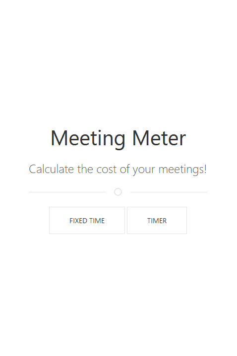

# Meeting meter

A silly Vanilla JS project to calculate the cost of meetings.  
Live version: https://meetingmeter.hugodlb.fr.

Two modes are available :
- Timer
- Fixed time

Made with &#9829; with Vanilla JS and UIKit.

# Preview

